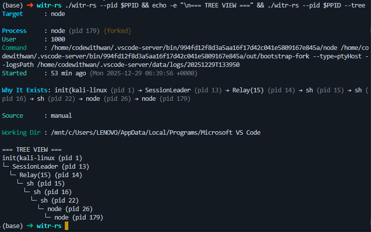

# witr-rs

[](https://github.com/rewrite-everything-in-rust/witr-rs/actions)
[](https://github.com/rewrite-everything-in-rust/witr-rs/releases/latest)
[](https://github.com/rewrite-everything-in-rust/witr-rs)
[](LICENSE)

**A Rust rewrite of [witr (why-is-this-running)](https://github.com/pranshuparmar/witr)**

`witr-rs` is a cross-platform command-line tool that explains why processes are running on your system by tracing their ancestry and analyzing their context.



**Attribution:** This project is a complete Rust rewrite of the original [witr](https://github.com/pranshuparmar/witr) tool by [@pranshuparmar](https://github.com/pranshuparmar). The original project is licensed under Apache-2.0. This rewrite maintains feature parity while adding improved type safety, cross-platform support, and comprehensive testing. See [LICENSE](LICENSE) for details.

## Features

### Core Functionality

- Process inspection by name, PID, or listening port
- Full ancestry chain tracing with loop detection
- Git repository and branch detection
- Service detection (systemd on Linux, tasklist on Windows, launchd on macOS)
- Container detection (Docker, containerd, Kubernetes)
- Network port mapping and socket analysis
- Health status monitoring (zombie, stopped, high-cpu, high-mem, long-running)
- Fork status detection
- Environment variable inspection

### Output Modes

- **Detailed** (default) - Comprehensive process information with ancestry chain
- **Short** (`--short`) - One-line ancestry summary
- **Tree** (`--tree`) - Tree-like visualization of process hierarchy
- **JSON** (`--json`) - Machine-readable JSON output
- **Warnings** (`--warnings`) - Show only processes with issues
- **Environment** (`--env`) - Display environment variables only
- **Security Scan** (`--scan`) - System-wide security audit for malware and vulnerabilities
- **Watch Mode** (`--watch`) - Live interactive process monitoring

### Display Features

- Colored output with customizable color scheme
- Human-readable time formatting ("2 hours ago (Mon 2025-12-29 01:16:51 +0000)")
- Status badges for health, forked processes, containers, and services
- Optional no-color mode (`--no-color`) for scripting

## Installation

### Quick Install (Linux & macOS)

Use this one-liner to automatically download and install the correct binary for your system:

```bash
curl -fsSL https://raw.githubusercontent.com/rewrite-everything-in-rust/witr-rs/main/install.sh | sudo bash
```

### Pre-built Binaries (Manual)

Download the latest binary for your OS directly. These links always point to the latest release version.

| Platform    | Arch            | Download Link                                                                                                                 |
| ----------- | --------------- | ----------------------------------------------------------------------------------------------------------------------------- |
| **Linux**   | `amd64`         | [**Download**](https://github.com/rewrite-everything-in-rust/witr-rs/releases/latest/download/witr-rs-linux-amd64)            |
| **macOS**   | `Intel`         | [**Download**](https://github.com/rewrite-everything-in-rust/witr-rs/releases/latest/download/witr-rs-macos-amd64)            |
| **macOS**   | `Apple Silicon` | [**Download**](https://github.com/rewrite-everything-in-rust/witr-rs/releases/latest/download/witr-rs-macos-arm64)            |
| **Windows** | `amd64`         | [**Download .exe**](https://github.com/rewrite-everything-in-rust/witr-rs/releases/latest/download/witr-rs-windows-amd64.exe) |

> **Note:** On Linux/macOS, don't forget to make it executable: `chmod +x witr-rs-*`

### From Source

```bash
git clone https://github.com/rewrite-everything-in-rust/witr-rs.git
cd witr-rs
cargo install --path .
```

### Build Release Binary

```bash
cargo build --release
```

The binary will be located at `target/release/witr-rs` (or `witr-rs.exe` on Windows).

## Usage

### Basic Examples

```bash
# Inspect by process name
witr-rs explorer
witr-rs nginx

# Inspect by PID
witr-rs --pid 1234

# Inspect by port
witr-rs --port 8080

# Short ancestry output
witr-rs --pid 1234 --short

# Tree visualization
witr-rs explorer --tree

# JSON output for scripting
witr-rs --pid 1234 --json

# Show only warnings
witr-rs nginx --warnings

# View environment variables
witr-rs --pid 1234 --env

# Disable colored output
witr-rs explorer --no-color

# Run security scan (System-wide)
witr-rs --scan

# Run security scan on specific process
witr-rs explorer --scan

# Live watch mode
witr-rs --pid 1234 --watch
```

### Command-Line Options

```
USAGE:
    witr-rs [OPTIONS] [NAME]

ARGUMENTS:
    <NAME>    Process name to inspect

OPTIONS:
    -p, --pid <PID>       Inspect specific PID
    -P, --port <PORT>     Inspect process listening on port
    --short               One-line ancestry summary
    --tree                Show process ancestry tree
    --json                Output as JSON
    --warnings            Show only warnings
    --env                 Show environment variables only
    --security-scan       Run security vulnerability scan (alias: --scan, --sec)
    --watch               Live watch mode
    --no-color            Disable colored output
    -h, --help            Print help
    -V, --version         Print version
```

## Platform Support

| Feature             | Linux   | Windows  | macOS   |
| ------------------- | ------- | -------- | ------- |
| Process inspection  | Full    | Full     | Full    |
| Ancestry tracing    | Full    | Full     | Full    |
| Git detection       | Full    | Full     | Full    |
| Service detection   | systemd | tasklist | launchd |
| Container detection | Full    | Limited  | Limited |
| Port mapping        | /proc   | netstat  | lsof    |
| Health monitoring   | Full    | Full     | Full    |
| Environment vars    | Full    | Full     | Full    |

### Platform-Specific Implementations

**Linux**: Uses `/proc` filesystem for maximum efficiency and detail
**Windows**: Uses `netstat`, `tasklist`, and sysinfo crate
**macOS**: Uses `lsof`, `launchctl`, and sysinfo crate

## Security

- Read-only operations
- No destructive actions
- May require elevated permissions for full functionality

### Completed Features

- [x] Process inspection (PID, name, port)
- [x] Ancestry tracing with loop detection
- [x] Git repository and branch detection
- [x] Service detection (all platforms)
- [x] Container detection (Linux)
- [x] Network port mapping (all platforms)
- [x] Health status detection
- [x] Fork status detection
- [x] Environment variable inspection
- [x] Multiple output formats
- [x] Colored output with `--no-color` flag
- [x] Human-readable time formatting
- [x] Comprehensive testing
- [x] Security Scanning (Reverse Shell, Malware, Suspicious Dirs)
- [x] Systemd Unit File detection
- [x] Docker Restart Count detection

## TODO

### Resource Detection (macOS)

- [x] Implement ResourceContext detection via pmset commands
- [ ] Query energy impact, sleep prevention, thermal state, App Nap status (Partial)

### File Context Detection

- [x] Count open file descriptors (Linux: /proc/{pid}/fd, macOS: lsof -p)
- [x] Get file descriptor limits (Linux: /proc/{pid}/limits, macOS: ulimit)
- [ ] Detect locked files (Linux: /proc/locks, macOS: lsof -F)
- [ ] Detect watched directories (inotify/fsevents)

### Socket Info Enhancement

- [x] Detect socket state (macOS: lsof -i)
- [x] Detect socket state (Linux: /proc/net/tcp)
- [ ] Add human-readable state explanations
- [ ] Suggest workarounds for common issues (TIME_WAIT ports, etc)

### Restart Count Detection

- [x] For systemd: parse systemctl show {service} for NRestarts
- [ ] For launchd: check crash logs in ~/Library/Logs
- [x] For docker: use docker inspect to get restart count
- [ ] For pm2: parse pm2 jlist output

### Source Details

- [x] For systemd: show unit file path
- [ ] For systemd: show triggers, dependencies
- [ ] For launchd: show plist path, program arguments, keep alive settings
- [x] For docker: show image name, container ID
- [ ] For docker: docker-compose service

### Enhanced Warning System (Security Scan)

- [x] Detect processes with weak permissions (Run as root)
- [x] Detect suspicious directories (/tmp, /dev/shm)
- [x] Detect deleted binaries (Fileless execution)
- [x] Detect unusual parent process (Reverse Shell)
- [ ] Warn about excessive network connections
- [ ] Warn about high file descriptor usage
- [ ] Detect long-term zombie processes

### Platform Improvements

- [x] Windows: Restore and improve WMI/Tasklist support
- [x] Windows: Detect service startup type (auto/manual/disabled)
- [ ] macOS: Parse full plist for detailed trigger info

### Performance

- [ ] Cache system snapshot with TTL-based invalidation
- [ ] Parallelize git detection with rayon for deep trees
- [ ] Benchmark ancestry tracing and git detection

### Additional Features

- [ ] Process tree visualization (ASCII art like pstree)
- [ ] Watch mode (`--watch`) for continuous monitoring
- [ ] HTML export with styled output
- [ ] CSV export for scripting

## Security

This tool performs read-only operations and makes no destructive changes to your system. It may require elevated permissions on some platforms to access detailed process information.

## License

Apache 2.0 - Same as the original [witr](https://github.com/pranshuparmar/witr) project.
